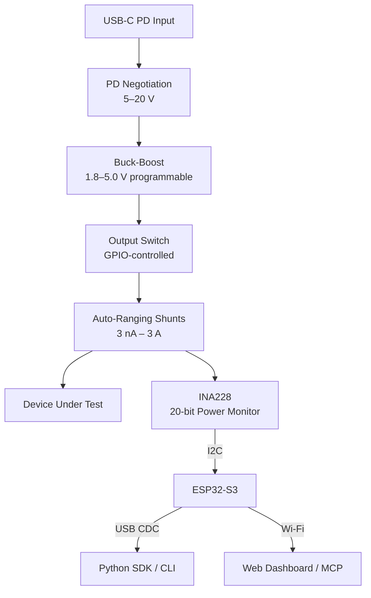
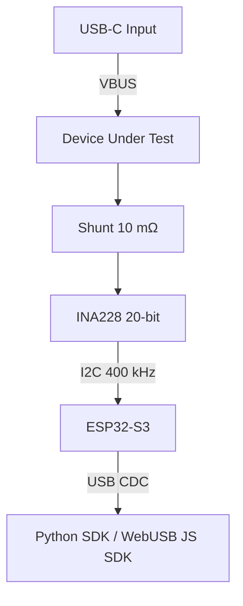

# insight-profiler
High-precision Open Source Power Profiler & Programmable Power Supply for IoT Development.

→ [Full feature plan](docs/FEATURES.md) · [Hardware block diagram](hardware/block-diagram.md)

## Planned Architecture



See [hardware/block-diagram.md](hardware/block-diagram.md) for the full diagram with current ranges and signal flow.

## Current Implementation (v0.1)



## Stack

| Layer | Technology |
|---|---|
| Firmware | ESP-IDF (C++), TinyUSB CDC |
| Power sensor | TI INA228 — voltage, current, power |
| Host SDK | Python (`pyserial`), TypeScript/WebUSB |
| AI integration | MCP server (planned) |

## Data Stream

The device streams 16-byte binary frames over USB CDC at ~1 kHz:

```
[0:4]   uint32  timestamp_us
[4:8]   float32 bus_voltage_v
[8:12]  float32 current_ma
[12:16] float32 power_mw
```

## Quick Start

### Python SDK

```python
from insight_profiler import InsightClient

client = InsightClient()
client.on_sample = lambda s: print(f"{s.current_ma:.3f} mA  {s.power_mw:.1f} mW")
client.connect()
```

### Firmware

```bash
cd firmware
idf.py build flash monitor
```

## Repository Structure

```
firmware/          ESP32-S3 firmware (ESP-IDF)
  components/
    ina228/        INA228 I2C driver
  main/            Application entry point
sdk-python/        Python host SDK
sdk-js/            TypeScript/WebUSB SDK
hardware/          Block diagram, schematics, PCB layout, BOM
docs/              Feature specs and design docs
```
