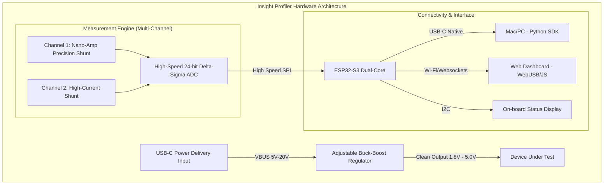

# insight-profiler
High-precision Open Source Power Profiler & Energy Analyzer for IoT Development.

## Hardware Architecture

```mermaid
graph TD
    subgraph "Insight Profiler Hardware Architecture"
        PD[USB-C Power Delivery Input] -->|VBUS 5V-20V| REG[Adjustable Buck-Boost Regulator]
        REG -->|Clean Output 1.8V - 5.0V| DUT[Device Under Test]

        subgraph "Measurement Engine (Multi-Channel)"
            S1[Channel 1: Nano-Amp Precision Shunt]
            S2[Channel 2: High-Current Shunt]
            ADC[High-Speed 24-bit Delta-Sigma ADC]
            S1 & S2 --> ADC
        end

        ADC -->|High Speed SPI| ESP[ESP32-S3 Dual-Core]

        subgraph "Connectivity & Interface"
            ESP -->|USB-C Native| MAC[Mac/PC - Python SDK]
            ESP -->|Wi-Fi/Websockets| WEB[Web Dashboard - WebUSB/JS]
            ESP -->|I2C| OLED[On-board Status Display]
        end
    end
```
