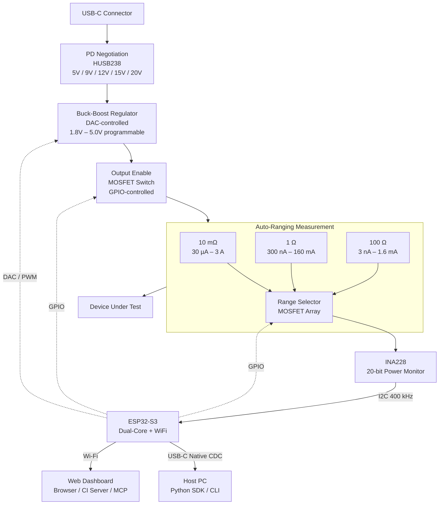

# Insight Profiler — Hardware Block Diagram



## Signal Flow

```
USB-C PD → regulated voltage → output switch → shunt array → DUT
                                                    ↓
                                               INA228 (I2C)
                                                    ↓
                                               ESP32-S3
                                              /         \
                                          USB CDC       Wi-Fi
```

## Current Ranges

| Shunt | Resolution | Max Current | Use Case |
|---|---|---|---|
| 100 Ω | ~3 nA | 1.6 mA | Deep sleep, µA IoT |
| 1 Ω | ~300 nA | 160 mA | Active IoT, BLE/WiFi bursts |
| 10 mΩ | ~30 µA | 3 A | Motors, displays, high-power loads |

Range switching is automatic — firmware selects the appropriate shunt based on measured current level.

## Voltage Output

| Source | Range | Notes |
|---|---|---|
| USB-C PD negotiation | 5 / 9 / 12 / 15 / 20 V | Fixed PD profiles |
| Buck-boost output | 1.8 V – 5.0 V | Continuously adjustable, DAC-controlled |

Target output accuracy: ±10 mV. Primarily intended for 1.8V–5.0V embedded devices.
